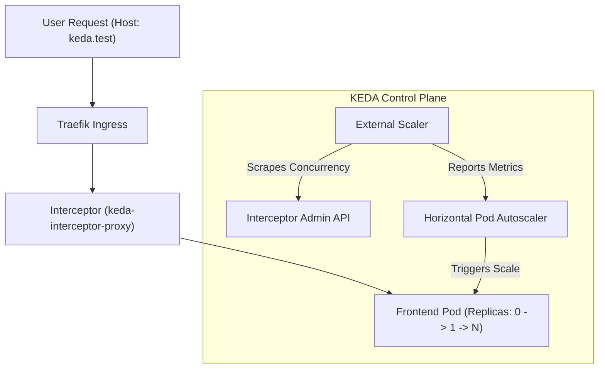

# k3d Microservices Playground

A simple 3-tier microservices demo running on `k3d`.

## Components
- **Frontend**: Node.js (Express)
- **Middleware**: Python (FastAPI)
- **Database**: PostgreSQL 16

## Pre-Requisites
- Docker
- k3d
- kubectl
- helm

## Quick Start
1. **Deploy**:
   ```bash
   ./deploy.sh
   ```
2. **Access**:
   [http://localhost:8080](http://localhost:8080)

[KEDA](https://keda.sh/) (Kubernetes Event-driven Autoscaling) is a single-purpose and lightweight component that can be added into any Kubernetes cluster and extends native Kubernetes scaling to support event-driven applications.

## KEDA HTTP Scaling (Elastic Stack)

This project implements **Traffic-Based Elastic Scaling** using the KEDA HTTP Add-on. This allows the Frontend to scale-to-zero when idle and rapidly scale-out based on concurrent request volume.

### Scaling Architecture


###  Key Findings & RBAC
- **RBAC Discovery**: The KEDA External Scaler requires explicit permissions to discover Interceptor endpoints. We've added a custom ClusterRole ([scaler-rbac-fix.yaml](file:///../k8s-keda/scaler-rbac-fix.yaml)) to resolve the `no valid interceptor endpoint` error common in fresh cluster deployments.
- **Timeout Alignment**: For long-running requests (e.g., our 5s-10s `/api/wait` tests), the Interceptor `responseHeader` timeout must be increased (default is 500ms). We've set this to **15s** in the `HTTPScaledObject`.
- **Host Routing**: Requests must include the `Host: keda.test` header to match the `HTTPScaledObject` routing rules.

### Validation
Run the automated validation script to verify cold-starts and horizontal scale-out:
```bash
./keda-test.sh
```

**Verification Targets:**
1. **Cold Start (0 to 1)**: First request triggers pod activation in < 1.5s.
2. **Scale-Out (> 1)**: Sustained concurrent load (100 requests) triggers expansion to multiple replicas.

## Timings
A GET request to `/` returns:
- `frontend_execution_time`: Local processing time.
- `middleware_rest_query_time`: Time taken for the REST call to FastAPI.
- `db_execution_time_ms`: Time taken for the DB query (returned by middleware).
- `X-Keda-Http-Cold-Start`: Header present only on activation requests.

## Example Output
```bash
$ ./keda-test.sh
---- KEDA Auto-scaling Validation (Enhanced) ---
Installing KEDA...
<snip />
Triggering activation via Ingress (expecting cold start)...
First Response (Cold Start Duration: 3651ms):
HTTP/1.1 200 OK
Content-Length: 220
Content-Type: application/json; charset=utf-8
Date: Thu, 09 Apr 2026 21:49:22 GMT
Etag: W/"dc-7tw9kvFlw0bks9SaENIKc61HR1I"
X-Keda-Http-Cold-Start: true
X-Powered-By: Express

{"message":"Hello Marc","timings":{"frontend_execution_time":"43.22ms","middleware_rest_query_time":"43.21ms"},"middleware_response":{"status":"success","data":"Hello from Postgres backend","db_execution_time_ms":17.99}}
Verifying activation...
SUCCESS: Frontend activated! (Replicas: 1)
Triggering sustained scale-out load (100 requests, 10s each, staggered)...
Waiting for KEDA to detect load and scale out (60s)...
Current Replicas: 32
SUCCESS: Frontend scaled out to 32 replicas!
--- Validation Complete ---
```
Note the initial cold start duration of 3651ms. This is the time it takes for the first pod to be spun up and the request to be processed. The subsequent requests are processed much faster as the pods are already running.

```bash
$ kubectl get hpa --watch
NAME                        REFERENCE             TARGETS      MINPODS   MAXPODS   REPLICAS   AGE
keda-hpa-frontend-scaling   Deployment/frontend   80/2 (avg)   1         100       1          22s
keda-hpa-frontend-scaling   Deployment/frontend   0/2 (avg)    1         100       4          30s
^C
$ kubectl get po
NAME                         READY   STATUS    RESTARTS   AGE
backend-7bf6f7bd56-wmx5t     1/1     Running   0          77s
frontend-8476569fb7-8bxzp    1/1     Running   0          2s
frontend-8476569fb7-9kzgx    1/1     Running   0          2s
frontend-8476569fb7-br5qf    1/1     Running   0          17s
frontend-8476569fb7-bx8ns    1/1     Running   0          47s
...
```