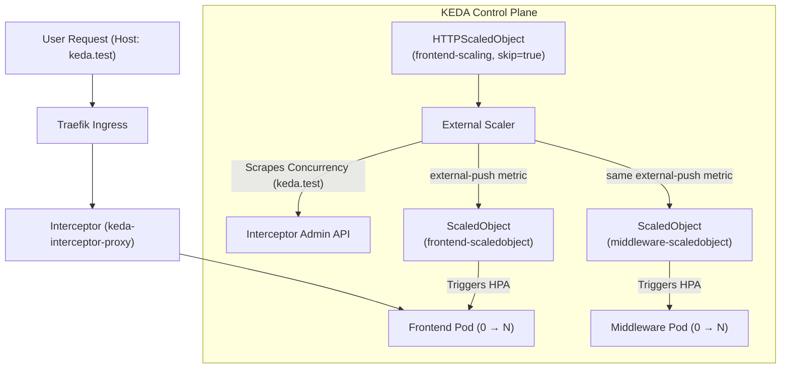

# k3d Microservices Playground

A simple 3-tier microservices demo running on `k3d`.

## Components
- **Frontend**: Node.js (Express)
- **Middleware**: Python (FastAPI)
- **Database**: PostgreSQL 16

## Pre-Requisites
- Docker
- k3d
- kubectl
- helm

## Quick Start
1. **Deploy**:
   ```bash
   ./deploy.sh
   ```
2. **Access**:
   [http://localhost:8080](http://localhost:8080)

## KEDA - Overview

[KEDA](https://keda.sh/) (Kubernetes Event-driven Autoscaling) is a single-purpose and lightweight component that can be added into any Kubernetes cluster and extends native Kubernetes scaling to support event-driven applications.

## KEDA HTTP Scaling (Elastic Stack)

This PoC project implements **Traffic-Based Elastic Scaling** using the KEDA HTTP Add-on. This allows the Frontend to scale-to-zero when idle and rapidly scale-out based on concurrent request volume.

### Scaling Architecture

The key design: a single `HTTPScaledObject` owns the `keda.test` hostname and routes intercepted traffic to `frontend`. Two custom `ScaledObject` resources (one per service) both subscribe to the **same** `external-push` scaler signal emitted by that `HTTPScaledObject`. This causes `frontend` and `middleware` to activate and scale out symmetrically from the same traffic event.
More information about integrating the HTTP Addon with other scalers is available [here](https://kedacore.github.io/http-add-on/walkthrough.html#integrating-http-add-on-scaler-with-other-keda-scalers)



- **Symmetrical Scaling**: A single `HTTPScaledObject` (with `skip-scaledobject-creation: "true"`) owns the `keda.test` host and intercepts traffic. Two custom `ScaledObject` resources both reference the same `external-push` trigger from `frontend-scaling`, ensuring frontend and middleware activate and scale together from a single entrypoint.
- **RBAC Discovery**: The KEDA External Scaler requires explicit permissions to discover Interceptor endpoints. A custom ClusterRole ([scaler-rbac-fix.yaml](file:///../k8s-keda/scaler-rbac-fix.yaml)) resolves the `no valid interceptor endpoint` error.
- **Timeout Alignment**: For long-running requests, the Interceptor `responseHeader` timeout is set to **15s** in the `HTTPScaledObject`.
- **Host Routing**: Requests must include the `Host: keda.test` header to match the `HTTPScaledObject` routing rules.

### Validation
Run the automated validation script to verify cold-starts and horizontal scale-out:
```bash
./keda-test.sh
```

**Verification Targets:**
1. **Cold Start (0 to 1)**: First request triggers pod activation in < 1.5s.
2. **Scale-Out (> 1)**: Sustained concurrent load (100 requests) triggers expansion to multiple replicas.

## Timings
A GET request to `/` returns:
- `frontend_execution_time`: Local processing time.
- `middleware_rest_query_time`: Time taken for the REST call to FastAPI.
- `db_execution_time_ms`: Time taken for the DB query (returned by middleware).
- `X-Keda-Http-Cold-Start`: Header present only on activation requests.

## Example Output
```bash
$ ./keda-test.sh
---- KEDA Auto-scaling Validation (Enhanced) ---
Installing KEDA...
<snip />
Triggering activation via Ingress (expecting cold start)...
First Response (Cold Start Duration: 6470ms):
HTTP/1.1 200 OK
Content-Length: 220
Content-Type: application/json; charset=utf-8
Date: Fri, 10 Apr 2026 19:47:42 GMT
Etag: W/"dc-5dn9d6kayRkY8eQOrBzs/u7ZXVs"
X-Keda-Http-Cold-Start: true
X-Powered-By: Express

{"message":"Hello Marc","timings":{"frontend_execution_time":"45.08ms","middleware_rest_query_time":"45.07ms"},"middleware_response":{"status":"success","data":"Hello from Postgres backend","db_execution_time_ms":17.91}}
Verifying activation...
SUCCESS: Both services activated! (Frontend: 1, Middleware: 1)
Triggering sustained scale-out load (100 requests, 10s each, staggered)...
Waiting for KEDA to detect load and scale out (60s)...
Current Replicas - Frontend: 32, Middleware: 32
SUCCESS: Symmetrical scale out confirmed!
--- Validation Complete ---
```
Note the initial cold start duration of 6470ms. This is the time it takes for the first frontend and middleware pods to be spun up and the request to be processed. The subsequent requests are processed much faster as the pods are already running. The fact that both frontend and middleware are scaled out is a result of the symmetrical scaling configuration.

```bash
$ kubectl get hpa --watch
NAME                               REFERENCE               TARGETS             MINPODS   MAXPODS   REPLICAS   AGE
keda-hpa-middleware-scaledobject   Deployment/middleware   <unknown>/2 (avg)   1         100       0          0s
keda-hpa-frontend-scaledobject     Deployment/frontend     <unknown>/2 (avg)   1         100       0          0s
keda-hpa-middleware-scaledobject   Deployment/middleware   90/2 (avg)          1         100       1          15s
keda-hpa-frontend-scaledobject     Deployment/frontend     90/2 (avg)          1         100       1          15s
^C
$ kubectl get po
NAME                         READY   STATUS    RESTARTS   AGE
backend-7bf6f7bd56-svznm     1/1     Running   0          69s
frontend-8476569fb7-hdfzd    1/1     Running   0          28s
frontend-8476569fb7-plzgb    1/1     Running   0          13s
frontend-8476569fb7-pvrc8    1/1     Running   0          13s
frontend-8476569fb7-xs5lg    1/1     Running   0          13s
middleware-cdbbb6596-4vkdd   1/1     Running   0          13s
middleware-cdbbb6596-9lbf9   1/1     Running   0          13s
middleware-cdbbb6596-c6wzb   1/1     Running   0          13s
middleware-cdbbb6596-jjlpw   1/1     Running   0          28s
...
```